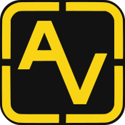

> 🇬🇧 [English version](../en/index.md)

  

# Documentazione di Ansvil

Ansvil è un container Docker leggero e modulare basato su **AlmaLinux**, progettato per offrire un ambiente completo, stabile e portatile per l'automazione con **Ansible**.

## Contenuto del progetto

- **AlmaLinux 9.x** – base compatibile con RHEL, stabile e sicura
- **Ansible** – cuore del sistema di automazione
- **Code-Server** – Visual Studio Code accessibile via browser
- **Semaphore UI** – frontend per il controllo dei task Ansible

## Sezioni

- [Avvio rapido](quick-start.md)
- [Deployment e porte](deployment.md)
- [Accesso e credenziali](access.md)
- [Hook di inizializzazione](hooks.md)
- [Comandi del Makefile](makefile.md)
- [Licenza](license.md)
